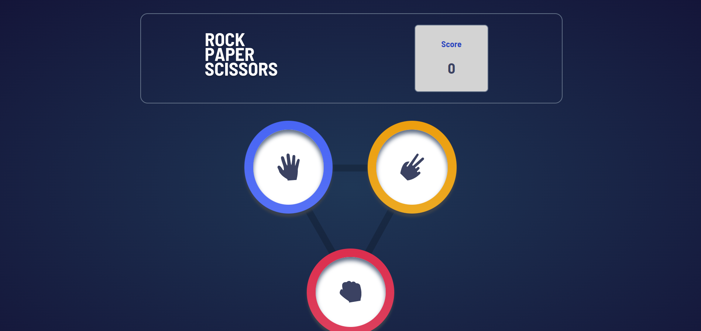

# Frontend Mentor - Rock, Paper, Scissors solution

This is a solution to the [Rock, Paper, Scissors challenge on Frontend Mentor](https://www.frontendmentor.io/challenges/rock-paper-scissors-game-pTgwgvgH). Frontend Mentor challenges help you improve your coding skills by building realistic projects. 

## Table of contents

  - [The challenge](#the-challenge)
  - [Screenshot](#screenshot)
  - [Links](#links)
- [My process](#my-process)
  - [Built with](#built-with)
  - [What I learned](#what-i-learned)
  - [Continued development](#continued-development)
- [Author](#author)


### The challenge

Users should be able to:

- View the optimal layout for the game depending on their device's screen size
- Play Rock, Paper, Scissors against the computer

### Screenshot




### Links

- Solution URL: [GitHub](https://github.com/phellwege/RockPaperScissors)
- Live Site URL: [Live Site](https://phellwege.github.io/RockPaperScissors/)

## My process

### Built with

- Semantic HTML5 markup
- CSS custom properties
- Flexbox
- CSS Grid
- Mobile-first workflow
- [React](https://reactjs.org/) - JS library


### What I learned

I learned how to effectively use state and props in order to play rock-paper-scissors

```js
const Transitioning = () => {
        const y = document.getElementsByClassName('select')[0];
        const x = document.getElementsByClassName('result')[0];
        if(x.style.display == 'block') {
            x.style.display = 'none';
            y.style.display = 'block';
        }
        else {
            y.style.display = 'none';
            x.style.display = 'block';
        }
    }
```
### Continued development

One takeaway from this is that react functions are fully asynchronous and that can lead to interesting issues that proved unexpected in this particular project.


## Author

- Website - [Peters-portfolio](http://peters-portfolio.net/)
- Frontend Mentor - [@yourusername](https://www.frontendmentor.io/profile/phellwege)

